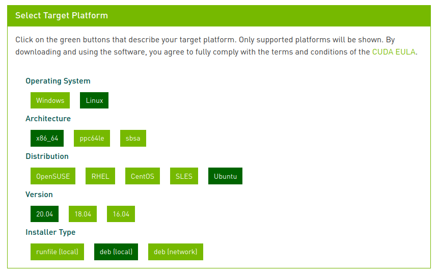
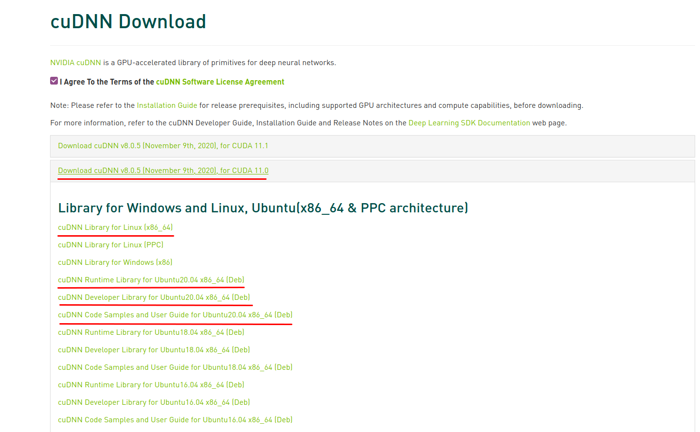

# Install Tensorflow with CUDA on Ubuntu 20.04

## (If necessary) Uninstall existing versions of CUDA

1. Uninstall nvidia-cuda-toolkit and it's dependencies

`sudo apt-get remove --auto-remove nvidia-cuda-toolkit`

2. Purging config/data
```
sudo apt-get purge --auto-remove nvidia-cuda-toolkit
sudo apt autoremove --purge cuda
sudo apt-get autoremove
sudo apt-get autoclean
sudo rm -rf /usr/local/cuda*
sudo apt-get purge libcudnn*
sudo apt-get update
sudo apt-get upgrade
```
3. Clean bash

Remove any exports in your bash file by running

`nano ~/.bashrc`

and checking for any commands with `export PATH=$PATH:/opt/cuda/bin` or `export LD_LIBRARY_PATH=$LD_LIBRARY_PATH:/opt/cuda/lib:/opt/cuda/lib64` or anything similar that involve cuda paths

`source ~/.bashrc`

4. check that no cuda folders remain

Run `ls /usr/local` and confirm that no cuda folders remain

## Check which CUDA and cuDNN version are needed

DO NOT JUST INSTALL THE MOST RECENT VERSION. MORE LIKELY THAN NOT, THAT IS NOT THE VERSION YOU WANT.

Every version of Tensorflow is compiled with specific versions of CUDA and cuDNN. Make sure to check [here](https://www.tensorflow.org/install/source#gpu) which versions you need.

1. Install kernel headers and development packages for the currently running kernel

`sudo apt-get install linux-headers-$(uname -r)`

2. Check which version of CUDA to get

Go to the CUDA homepage and navigate to the overview of [old versions](https://developer.nvidia.com/cuda-toolkit-archive) 

Click on the version you need (in my case 11.0) and click through the options for your target platform. For Installer Type, select **deb(local)**



3. Check Nvidia driver version

Before executing the installation instructions, check that your Nvidia driver version is sufficiently up to date. You can see the minimal driver version in the `wget` command for the cuda dev file. At the time of writing, this is the third command of the installation instructions:

wget http://developer.download.nvidia.com/compute/cuda/11.0.2/local_installers/cuda-repo-ubuntu2004-11-0-local_11.0.2-**450.51.05**-1_amd64.deb

The NVidia driver version is the number after the CUDA version, so 450.51.05 at the time of writing. Run `nvidia-smi` and check in the top line what version your Nvidia driver has. If your driver is outdated, you can install the current driver version via the "Software and Updates" app of Ubuntu or run 

`sudo apt update`
`sudo ubuntu-drivers devices`
`sudo ubuntu-drivers install`
`sudo reboot` to restart 

Afterwards, check that the driver version is updated using `nvidia-smi`

4. Execute CUDA installation instructions

Navigate to the location where to download files to, normally
`cd ~/Downloads`

```
wget https://developer.download.nvidia.com/compute/cuda/repos/ubuntu2004/x86_64/cuda-ubuntu2004.pin
sudo mv cuda-ubuntu2004.pin /etc/apt/preferences.d/cuda-repository-pin-600
wget http://developer.download.nvidia.com/compute/cuda/11.0.2/local_installers/cuda-repo-ubuntu2004-11-0-local_11.0.2-450.51.05-1_amd64.deb
sudo dpkg -i cuda-repo-ubuntu2004-11-0-local_11.0.2-450.51.05-1_amd64.deb
sudo apt-key add /var/cuda-repo-ubuntu2004-11-0-local/7fa2af80.pub
sudo apt-get update
sudo apt-get -y install cuda
```

5. Perform Post-Installation Actions

Add the CUDA installation to your path.
Run `nano ~/.bashrc` and add the following lines to a suitable location

```
export PATH=/usr/local/cuda-11.0/bin${PATH:+:${PATH}}
export LD_LIBRARY_PATH=/usr/local/cuda-11.0/lib64${LD_LIBRARY_PATH:+:${LD_LIBRARY_PATH}}
export CUDA_HOME=/usr/local/cuda-11.0
```
`source ~/.bashrc`

`sudo reboot` to restart the system

6. Test the installation


7. Install cuDNN

Go to the [cuDNN archive](https://developer.nvidia.com/rdp/cudnn-archive) and check what the latest version is for the version of cuDNN that you need. For Tensorflow 2.4.1, I need cuDNN 8.0. The last version for that version is cuDNN 8.0.5.39 (which can be seen by checking the link to the downloads)

Download cuDNN, the runtime library, the developer library, and the samples:


Unzip the cuDNN zip file `tar -xvzf cudnn-11.0-linux-x64-v8.0.5.39.tgz` and then copy the relevant files to the cuda installation
`sudo cp cuda/include/cudnn.h /usr/local/cuda/include`
`sudo cp cuda/lib64/libcudnn* /usr/local/cuda/lib64`

change the permission
`sudo chmod a+r /usr/local/cuda/include/cudnn.h /usr/local/cuda/lib64/libcudnn*`

and delete the extracted files
`sudo rm -rf cuda`

Next, install the deb packages

```
sudo dpkg -i libcudnn8_8.0.5.39-1+cuda11.0_amd64.deb
sudo dpkg -i libcudnn8-dev_8.0.5.39-1+cuda11.0_amd64.deb 
sudo dpkg -i libcudnn8-samples_8.0.5.39-1+cuda11.0_amd64.deb 
```

`sudo reboot` to restart

Test if installation was successful

Restart after the installation to test whether the installation is successful,

```
cp -r /usr/src/cudnn_samples_v8/ ~ 
cd ~/cudnn_samples_v8/mnistCUDNN/
make clean && make
./mnistCUDNN
``` 


